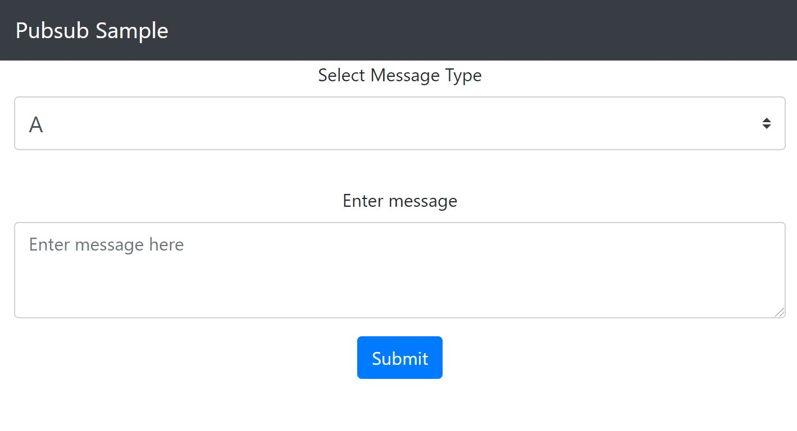

# Dapr Pub-Sub and Service invocation example

In this quickstart, you'll create a publisher microservice and a subscriber microservice to demonstrate Dapr Pub/Sub async communication. Additionally, you will create another service that is invoked via synchronous service invocation. In both cases the publisher will generate messages of a specific topic, while subscribers/invoked service will listen for messages of specific types. 

Visit [this](https://docs.dapr.io/developing-applications/building-blocks/pubsub/) link for more information about Dapr and Pub-Sub.

This quickstart includes one publisher:

- React front-end message generator

And one subscriber:
 
- Python subscriber

And one service that is invoked:

- C# service

Dapr uses pluggable message buses to enable pub-sub, and delivers messages to subscribers in a [Cloud Events](https://github.com/cloudevents/spec) compliant message envelope. in this case you'll use Redis Streams (enabled in Redis versions => 5). The following architecture diagram illustrates how components interconnect locally:


Dapr allows you to deploy the same microservices from your local machines to the cloud. Correspondingly, this quickstart has instructions for deploying this project [locally](#Run-Locally) or in [Kubernetes](#Run-in-Kubernetes). 

## Prerequisites

### Prerequisites to run locally

- [Dapr CLI with Dapr initialized](https://docs.dapr.io/getting-started/install-dapr-cli/)
- [Node.js version 14 or greater](https://nodejs.org/en/) and/or [Python 3.4 or greater](https://www.python.org/) and/or [Asp.Net Core 6](https://dotnet.microsoft.com/download/dotnet/6.0): You can run this quickstart with one or both or all microservices

### Prerequisites to Run in Kubernetes

- [Dapr enabled Kubernetes cluster](https://docs.dapr.io/operations/hosting/kubernetes/kubernetes-deploy/)

## Run locally

In order to run this locally, each of the microservices need to run with Dapr. Start by running message subscribers.

### Clone this repository

0. Clone this repository to your local machine.

### Run Python message subscriber with Dapr

1. Open a new CLI window and navigate to Python subscriber directory in your CLI: 

```bash
cd python-subscriber
```

2. Install python dependencies:

```bash
python -m venv venv  
source ./venv/bin/activate  
pip install -r requirements.txt 
```

3. Run the Python subscriber app with Dapr:
    
```bash
dapr run --app-id python-subscriber --app-port 5001 python3 app.py
```

### Run C# service with Dapr

1. Open a new CLI window and navigate to C# service directory in your CLI:

```bash
cd csharp-service
```

2. Build Asp.Net Core app:

```bash
dotnet build
```

3. Run the C# subscriber app with Dapr:
    
```bash
dapr run --app-id csharp-subscriber --app-port 5009 dotnet run csharp-subscriber.csproj
```

### Run the React front end with Dapr

Now, run the React front end with Dapr. The front end will publish different kinds of messages that subscribers will pick up.

1. Open a new CLI window and navigate to the react-form directory:

```bash
cd react-form
```

2. Run the React front end app with Dapr: 

```bash
npm run buildclient
```

```bash
npm install
```

```bash
dapr run --app-id react-form --app-port 8080 npm run start
```

This may take a minute, as it downloads dependencies and creates an optimized production build. You'll know that it's done when you see `== APP == Listening on port 8080!` and several Dapr logs.

3. Open the browser and navigate to "http://localhost:8080/". You should see a form with a dropdown for message type and message text:



4. Pick a topic, enter some text and fire off a message! Observe the logs coming through your respective Dapr. Note that the Node.js subscriber receives messages of type "A" and "B", while the Python subscriber receives messages of type "A" and "C". Note that logs are showing up in the console window where you ran each one: 

```bash
== APP == Listening on port 8080!
```

5. Use the [restsamples](restsamples.http) file to test service invocation to the csharp-service.

   
6. **Optional**: Try publishing a message of topic B. You'll notice that only the Node app will receive this message. The same is true for topic 'C' and the python app.

```bash
curl -s http://localhost:8080/publish -H Content-Type:application/json --data @message_b.json
```

```bash
curl -s http://localhost:8080/publish -H Content-Type:application/json --data @message_c.json
```

3. Cleanup

```bash
dapr stop --app-id node-subscriber
```

```bash
dapr stop --app-id python-subscriber
```

```bash
dapr stop --app-id csharp-subscriber
```

```bash
dapr stop --app-id react-form
```

4. If you want to deploy this same application to Kubernetes, move onto the next step. Otherwise, skip ahead to the [How it Works](#How-it-Works) section to understand the code!


## Run in Kubernetes

To run the same code in Kubernetes, first set up a Redis store and then deploy the microservices. You'll be using the same microservices, but ultimately the architecture is a bit different: 


### Set up a Redis store

Dapr uses pluggable message buses to enable pub-sub, in this case Redis Streams (enabled in Redis version 5 and above) is used. You'll install Redis into the cluster using helm, but keep in mind that you could use whichever Redis host you like, as long as the version is greater than 5.

1. Follow [these steps](https://docs.dapr.io/getting-started/tutorials/configure-state-pubsub/) to create a Redis store using Helm. 
   > **Note**: Currently the version of Redis supported by Azure Redis Cache is less than 5, so using Azure Redis Cache will not work.
2. Once your store is created, add the keys to the `redis.yaml` file in the `deploy` directory. Don't worry about applying the `redis.yaml`, as it will be covered in the next step. 
   > **Note:** the `redis.yaml` file provided in this quickstart takes plain text secrets. In a production-grade application, follow [secret management](https://docs.dapr.io/developing-applications/building-blocks/secrets/) instructions to securely manage your secrets.

### Deploy assets

Now that the Redis store is set up, you can deploy the assets.

1. In your CLI window, navigate to the deploy directory
2. To deploy the publisher and three subscriber microservices, as well as the redis configuration you set up in the last step, run:

<!-- STEP
name: Deploy to k8s
working_dir: deploy
expected_stdout_lines:
  - "deployment.apps/scriber created"
  - "deployment.apps/node-subscriber created"
  - "deployment.apps/python-subscriber created"
  - "service/react-form created"
  - "deployment.apps/react-form created"
  - 'deployment "node-subscriber" successfully rolled out'
  - 'deployment "python-subscriber" successfully rolled out'
  - 'deployment "scriber" successfully rolled out'
  - 'deployment "react-form" successfully rolled out'
-->

```bash
kubectl apply -f .
```

Kubernetes deployments are asyncronous. This means you'll need to wait for the deployment to complete before moving on to the next steps. You can do so with the following command:

```bash
kubectl rollout status deploy/node-subscriber
```

```bash
kubectl rollout status deploy/python-subscriber
```

```bash
kubectl rollout status deploy/csharp-subscriber
```

```bash
kubectl rollout status deploy/react-form
```

<!-- END_STEP -->


3. To see each pod being provisioned run:

```bash
kubectl get pods
```

4. To get the external IP exposed by the `react-form` microservice, run 

```bash
kubectl get svc -w
```

This may take a few minutes.

> **Note:** Minikube users cannot see the external IP. Instead, you can use `minikube service [service_name]` to access loadbalancer without external IP.

### Use the app

1. Access the web form.

There are several different ways to access a Kubernetes service depending on which platform you are using. Port forwarding is one consistent way to access a service, whether it is hosted locally or on a cloud Kubernetes provider like AKS.

<!-- STEP
name: Port forward
background: true
sleep: 2
timeout_seconds: 10
expected_return_code:
-->

```bash
kubectl port-forward service/react-form 8000:80
```

<!-- END_STEP -->

This will make your service available on http://localhost:8000

> **Optional**: If you are using a public cloud provider, you can substitue your EXTERNAL-IP address instead of port forwarding. You can find it with:

```bash 
kubectl get svc react-form
```

2. Create and submit messages of different types.

Open a web brower and navigate to http://localhost:8000 and you see the same form as with the locally hosted example above.

<!-- STEP
name: Curl validation k8s
expected_stdout_lines:
  - "OK"
  - "OK"
  - "OK"
expected_stderr_lines:
-->

> **Note:** If you are running in an environment without easy access to a web browser, the following curl commands will simulate a browser request to the node server.


```bash
curl -s http://localhost:8000/publish -H Content-Type:application/json --data @message_a.json
```

```bash
curl -s http://localhost:8000/publish -H Content-Type:application/json --data @message_b.json
```

```bash
curl -s http://localhost:8000/publish -H Content-Type:application/json --data @message_c.json
```

<!-- END_STEP -->

3. To see the logs generated from your subscribers: 

<!-- STEP
name: Deploy Node App
expected_stdout_lines:
  - "A:  Message on A"
  - "B:  Message on B"
-->

```bash
kubectl logs --selector app=node-subscriber -c node-subscriber
```

<!-- END_STEP -->

<!-- STEP
name: Deploy Python App
expected_stdout_lines:
  - 'Received message "Message on A" on topic "A"'
  - 'Received message "Message on C" on topic "C"'
-->

```bash
kubectl logs --selector app=python-subscriber -c python-subscriber
```

<!-- END_STEP -->

<!-- STEP
name: Deploy Csharp App
expected_stdout_lines:
  - "A: Message on A"
expected_stderr_lines:
output_match_mode: substring
sleep: 10
-->

```bash
kubectl logs --selector app=csharp-subscriber -c csharp-subscriber
```

<!-- END_STEP -->

4. Note that the Node.js subscriber receives messages of type "A" and "B", while the Python subscriber receives messages of type "A" and "C" and the C# subscriber receives messages of type "A" and "B" and "C".

### Cleanup

Once you're done, you can spin down your Kubernetes resources by navigating to the `./deploy` directory and running:

<!-- STEP
name: Cleanup
working_dir: deploy
expected_stdout_lines:
  - 'deployment.apps "scriber" deleted'
  - 'deployment.apps "node-subscriber" deleted'
  - 'deployment.apps "python-subscriber" deleted'
  - 'service "react-form" deleted'
  - 'deployment.apps "react-form" deleted'
  - 'component.dapr.io "pubsub" deleted'
-->

```bash
kubectl delete -f .
```

<!-- END_STEP -->

This will spin down each resource defined by the .yaml files in the `deploy` directory, including the state component.

## How it works

Now that you've run the quickstart locally and/or in Kubernetes, let's unpack how this all works. the app is broken up into two subscribers and one publisher:

### Node message subscriber

Navigate to the `node-subscriber` directory and open `app.js`, the code for the Node.js subscriber. Here three API endpoints are exposed using `express`. The first is a GET endpoint: 

```js
app.get('/dapr/subscribe', (_req, res) => {
    res.json([
        {
            pubsubname: "pubsub",
            topic: "A",
            route: "A"
        },
        {
            pubsubname: "pubsub",
            topic: "B",
            route: "B"
        }
    ]);
});
```

This tells Dapr what topics in which pubsub component to subscribe to. When deployed (locally or in Kubernetes), Dapr will call out to the service to determine if it's subscribing to anything. The other two endpoints are POST endpoints:

```js
app.post('/A', (req, res) => {
    console.log("A: ", req.body.data.message);
    res.sendStatus(200);
});

app.post('/B', (req, res) => {
    console.log("B: ", req.body.data.message);
    res.sendStatus(200);
});
```

These handle messages of each topic type coming through. Note that this simply logs the message. In a more complex application this is where you would include topic-specific handlers. 

### Python message subscriber

Navigate to the `python-subscriber` directory and open `app.py`, the code for the Python subscriber. As with the Node.js subscriber, we're exposing three API endpoints, this time using `flask`. The first is a GET endpoint: 

```python
@app.route('/dapr/subscribe', methods=['GET'])
def subscribe():
    subscriptions = [{'pubsubname': 'pubsub', 'topic': 'A', 'route': 'A'}, {'pubsubname': 'pubsub', 'topic': 'C', 'route': 'C'}]
    return jsonify(subscriptions)
```
Again, this is how you tell Dapr what topics in which pubsub component to subscribe to. In this case, subscribing to topics "A" and "C" of pubsub component named 'pubsub'. Messages of those topics are handled with the other two routes:

```python
@app.route('/A', methods=['POST'])
def a_subscriber():
    print(f'A: {request.json}', flush=True)
    print('Received message "{}" on topic "{}"'.format(request.json['data']['message'], request.json['topic']), flush=True)
    return json.dumps({'success':True}), 200, {'ContentType':'application/json'}

@app.route('/C', methods=['POST'])
def c_subscriber():
    print(f'C: {request.json}', flush=True)
    print('Received message "{}" on topic "{}"'.format(request.json['data']['message'], request.json['topic']), flush=True)
    return json.dumps({'success':True}), 200, {'ContentType':'application/json'}
```

Note: if `flush=True` is not set, logs will not appear when running `kubectl get logs...`. This is a product of Python's output buffering.

### C# message subscriber

Navigate to the `csharp-subscriber` directory and open `Program.cs`, the code for the C# subscriber. We're exposing three API endpoints, this time using `Asp.Net Core 6 Minimal API`.

Again, this is how you tell Dapr what topics in which pubsub component to subscribe to. In this case, subscribing to topics "A" and "B" and "C" of pubsub component named 'pubsub'. Messages of those topics are handled with these three routes:

```csharp
using Dapr;

var builder = WebApplication.CreateBuilder(args);

var app = builder.Build();

// Dapr configurations
app.UseCloudEvents();

app.MapSubscribeHandler();

app.MapPost("/A", [Topic("pubsub", "A")] (ILogger<Program> logger, MessageEvent item) => {
    logger.LogInformation($"{item.MessageType}: {item.Message}");
    return Results.Ok();
});

app.MapPost("/B", [Topic("pubsub", "B")] (ILogger<Program> logger, MessageEvent item) => {
    logger.LogInformation($"{item.MessageType}: {item.Message}");
    return Results.Ok();
});

app.MapPost("/C", [Topic("pubsub", "C")] (ILogger<Program> logger, Dictionary<string, string> item) => {
    logger.LogInformation($"{item["messageType"]}: {item["message"]}");
    return Results.Ok();
});

app.Run();

internal record MessageEvent(string MessageType, string Message);
```

### React front end

Our publisher is broken up into a client and a server:

#### Client

The client is a simple single page React application that was bootstrapped with [Create React App](https://github.com/facebook/create-react-app). The relevant client code sits in `react-form/client/src/MessageForm.js` where a form is presented to the users. As users update the form, React state is updated with the latest aggregated JSON data. By default the data is set to:

```js
{
    messageType: "A",
    message: ""
};
```
Upon submission of the form, the aggregated JSON data is sent to the server:

```js
fetch('/publish', {
    headers: {
        'Accept': 'application/json',
        'Content-Type': 'application/json'
    },
    method:"POST",
    body: JSON.stringify(this.state),
});
```

#### Server

The server is a basic express application that exposes a POST endpoint: `/publish`. This takes the requests from the client and publishes them against Dapr. Express's built in JSON middleware function is used to parse the JSON out of the incoming requests:

```js
app.use(express.json());
```

This allows us to determine which topic to publish the message with. To publish messages against Dapr, the URL needs to look like: `http://localhost:<DAPR_URL>/publish/<PUBSUB_NAME>/<TOPIC>`, so the `publish` endpoint builds a URL and posts the JSON against it. The POST request also needs to return a success code in the response upon successful completion.   

```js
  const publishUrl = `${daprUrl}/publish/${pubsubName}/${req.body?.messageType}`;
  await axios.post(publishUrl, req.body);
  return res.sendStatus(200);
```

Note how the `daprUrl` determines what port Dapr live on: 

```js
const daprUrl = `http://localhost:${process.env.DAPR_HTTP_PORT || 3500}/v1.0`;
```

By default, Dapr live on 3500, but if we're running Dapr locally and set it to a different port (using the `--app-port` flag in the CLI `run` command), then that port will be injected into the application as an environment variable.

The server also hosts the React application itself by forwarding default home page `/` route requests to the built client code:

```js
app.get('/', function (_req, res) {
  res.sendFile(path.join(__dirname, 'client/build', 'index.html'));
});
```